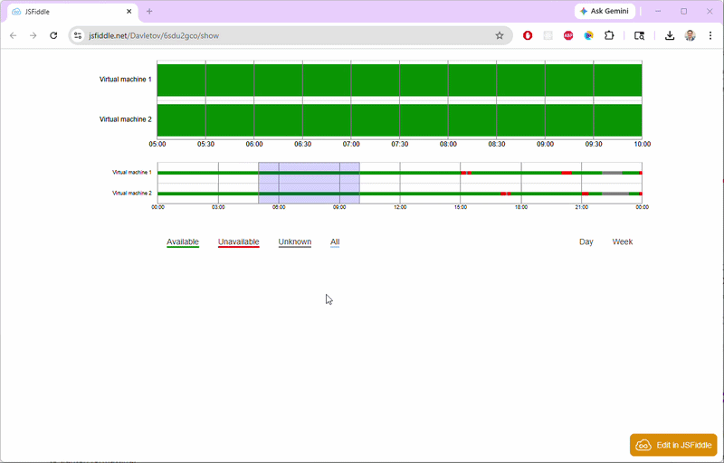

# Availability Explorer

Interactive data visualization component for analyzing system availability over time.

Originally built for production use in Azure-based systems and used for 6+ years to analyze service uptime, incidents, and system health.

---

## 🚀 Key Features

- Zoomable timeline (overview + detailed view)
- Handles large time-series datasets efficiently
- Visualizes availability states (available / unavailable / unknown)
- Designed for real-world production monitoring scenarios

---

## 🖼 Demo

Or try it here:  
👉 https://jsfiddle.net/Davletov/6sdu2gco/show

---

## 🧠 Why This Matters

Understanding system availability is critical for:
- debugging incidents  
- analyzing downtime patterns  
- improving reliability  

This component was designed to help engineers quickly identify issues in large-scale distributed systems.

---

## ⚙️ Tech Stack

- JavaScript  
- D3.js  
- HTML / CSS  

---

## 📦 Project Structure

- `js/` — core visualization logic  
- `css/` — styles  
- `mockData/` — sample datasets  
- `index.html` — demo entry point  

---

## 📌 Notes

This is a simplified standalone version of a production component used in Azure systems.
